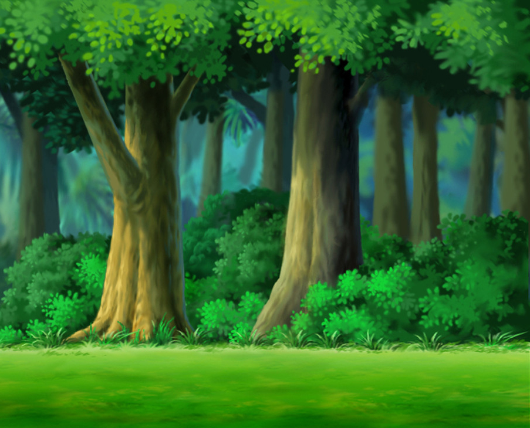

Include 3 possible ideas, include a paragraph summary and any visuals useful to explain your concept

# CIM640-Final

## idea 1
#### about bubble fish
Two fishes in the generative bubble sea. one is static, the other is moving with mouse. There is a background music. 

the eyes of moving fish using map()

when two fish collide with mouth to mouth, generate many peach hearts and start another song. also the eyes of both fish shine and become bigger.

when two fish collide , generate a bang sound the eyes of both fish become smaller.

## idea 2
#### about rabbit
two buttons for two background and two music: park andd forest.

rabbit is static, but the eyes of rabbit using map()

In the forest, using search button to find food. there are 3 kinds of food: carrot,broccoli and  pepper. when finding a carrot, the size of face become size+5. and broccoli-size+3,pepper-size+1. when she find food, generate a sound.

In the park, when mouse move to the sky wheel area, generate a happy sound. When mouse move to the merry-go-round area, generate a song.
when mouse move to the Ice-Cream Van, generate mouse water around the mouse.

## idea 3
#### about piano
A piano play machine

1. you  can press the keyboard on the piano to make sound.

2. you can press the button below to make sound. there are 3 buttons：random 1 key sound; random combination of 2 keys sound;random combination of 3 keys sound.

[click here for google](http://www.google.com)

 
